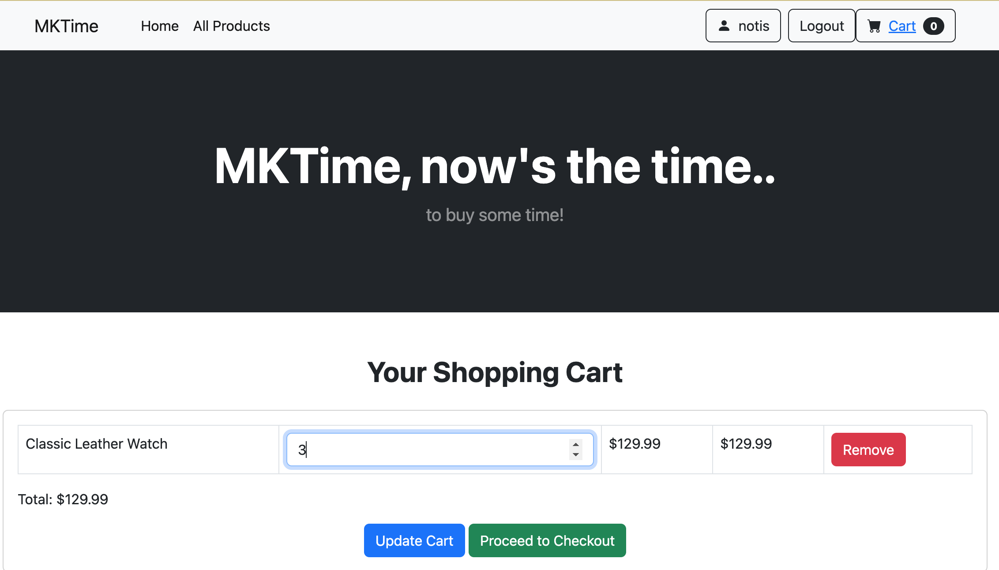
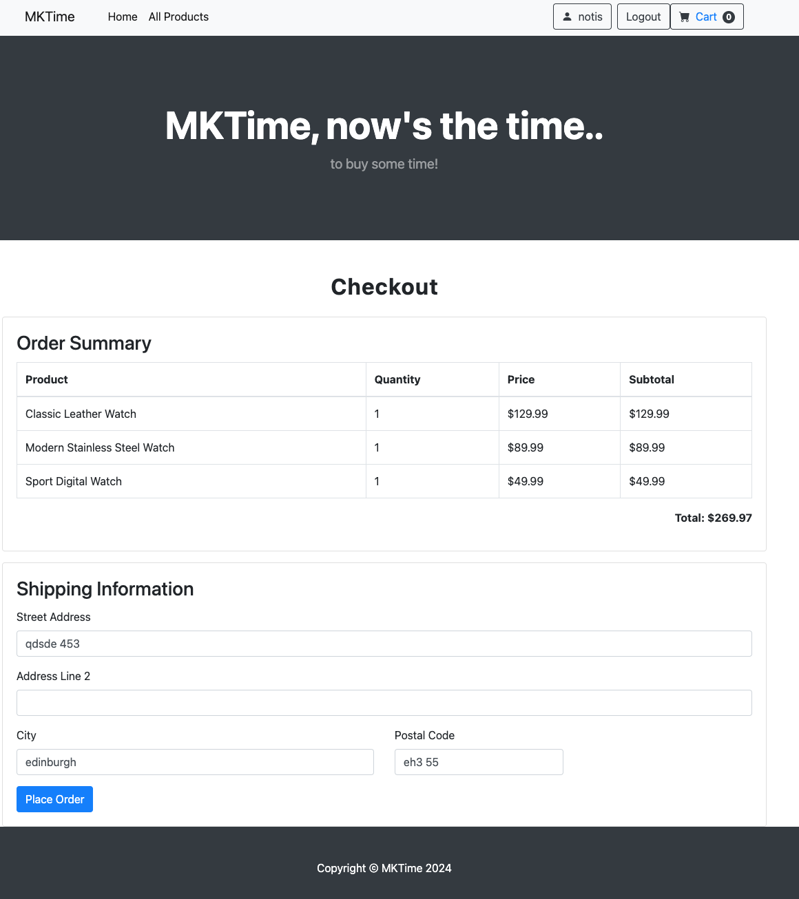
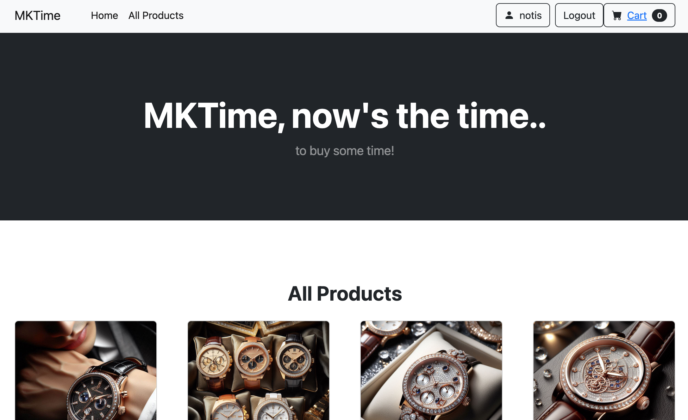

# MKTIME E-Commerce Project

## Overview

MKTIME is a PHP-based e-commerce project utilizing the Model-View-Controller (MVC) architectural pattern. It provides a simple online shopping experience, allowing users **register** and **login**, to browse products, add them to a **cart**, and proceed to **checkout**.

## Project Brief Overview

MKTIME is a prestigious retailer based in Scotland, specializing in the sale of high-quality Swiss watches. To expand its reach and increase sales, MKTIME aims to establish a robust online presence through a sophisticated eCommerce web application. The project focuses on creating a user-friendly platform that showcases MKTIME's collection of luxury timepieces and provides a seamless shopping experience across various devices.






## Features

- **User Authentication:**
    - Registration with input validation.
    - Login with secure password hashing.
    - Profile management (update personal details and address).
- **Product Catalog:**
    - Displays all available products with details (name, description, price, image).
    - Individual product views with additional information.
- **Shopping Cart (Session-Based):**
    - Add items to cart.
    - View and update cart contents.
    - Calculate order totals.
- **Checkout Process:**
    - (Basic) Order placement .
- **Additional:**
    - Session management for user persistence.
    - Error handling for common scenarios.

## Technologies Used

- **Backend:**
    - PHP
    - MySQL database
- **Frontend:**
    - HTML
    - CSS (with Bootstrap for styling)
    - JavaScript 
- **Database Tools:**
  - MySQL
  - phpMyAdmin
  - dbdiagram.io
- **Testing:**
    - Cypress for end-to-end testing (work in progress)

## File Structure

- **`controllers/`:** Contains PHP controller classes for handling user actions and business logic.
- **`cypress/e2e/`:** Houses Cypress test scripts for end-to-end testing.
- **`functions/`:** Includes helper PHP functions for various tasks (login, sessions, etc.).
- **`models/`:** Holds PHP model classes representing data entities (e.g., `Product_Class`).
- **`public/`:** Stores the main HTML, CSS, and JavaScript files for the frontend.
- **`views/`:** Contains PHP view files responsible for rendering HTML output.
- **`connect_db.php`:**  Handles database connection configuration.

## Database Structure

The project utilizes a relational database (MySQL) with the following tables:

- `users`
- `user_details`
- `products`
- `orders`
- `order_details`
- `order_history`

## Setup Instructions

1. **Clone the Repository:**
   ```bash
   git clone [https://github.com/your-username/MKTIME.git](https://github.com/your-username/MKTIME.git)
